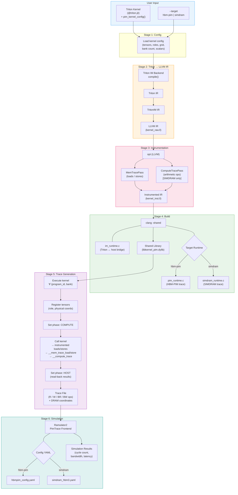

# TritonPIM End-to-End Flow Diagram

Copy the Mermaid block below into any Mermaid-compatible renderer
(Mermaid Live Editor, GitHub markdown, Overleaf with mermaid plugin, etc.).

```mermaid
flowchart TB
    subgraph UserInput["User Input"]
        K["Triton Kernel\n(@triton.jit)\n+ pim_kernel_config()"]
        TGT["--target\nhbm-pim | simdram"]
    end

    subgraph Stage1["Stage 1: Config"]
        CFG["Load kernel config\n(tensors, roles, grid,\nbank count, scalars)"]
    end

    subgraph Stage2["Stage 2: Triton → LLVM IR"]
        TC["Triton IM Backend\ncompile()"]
        TIR["Triton IR"]
        TTIR["TritonIM IR"]
        LLIR["LLVM IR\n(kernel_raw.ll)"]
        TC --> TIR --> TTIR --> LLIR
    end

    subgraph Stage3["Stage 3: Instrumentation"]
        OPT["opt (LLVM)"]
        MTP["MemTracePass\n(loads / stores)"]
        CTP["ComputeTracePass\n(arithmetic ops)\n[SIMDRAM only]"]
        OPT --> MTP
        OPT --> CTP
        INST["Instrumented IR\n(kernel_inst.ll)"]
        MTP --> INST
        CTP --> INST
    end

    subgraph Stage4["Stage 4: Build"]
        CLANG["clang -shared"]
        IMRT["im_runtime.c\n(Triton ↔ host bridge)"]
        PIMRT{"Target Runtime"}
        PIM_R["pim_runtime.c\n(HBM-PIM trace)"]
        SIM_R["simdram_runtime.c\n(SIMDRAM trace)"]
        PIMRT -->|hbm-pim| PIM_R
        PIMRT -->|simdram| SIM_R
        CLANG --- IMRT
        CLANG --- PIMRT
        SO["Shared Library\n(libkernel_pim.dylib)"]
        CLANG --> SO
    end

    subgraph Stage5["Stage 5: Trace Generation"]
        direction TB
        EXEC["Execute kernel\n∀ (program_id, bank)"]
        REG["Register tensors\n(role, physical coords)"]
        PHASE["Set phase: COMPUTE"]
        CALL["Call kernel\n→ instrumented loads/stores\n→ __mem_trace_load/store\n→ __compute_trace"]
        HOST["Set phase: HOST\n(read-back results)"]
        TRACE["Trace File\n(R / W / BR / BW ops)\n+ DRAM coordinates"]
        EXEC --> REG --> PHASE --> CALL --> HOST --> TRACE
    end

    subgraph Stage6["Stage 6: Simulation"]
        RAM["Ramulator2\nPimTrace Frontend"]
        YAML{"Config YAML"}
        HBM_Y["hbmpim_config.yaml"]
        SIM_Y["simdram_hbm3.yaml"]
        YAML -->|hbm-pim| HBM_Y
        YAML -->|simdram| SIM_Y
        RAM --- YAML
        CYCLES["Simulation Results\n(cycle count,\nbandwidth, latency)"]
        RAM --> CYCLES
    end

    K --> CFG
    TGT --> CFG
    CFG --> TC
    LLIR --> OPT
    INST --> CLANG
    SO --> EXEC
    TRACE --> RAM

    style UserInput fill:#e8f4fd,stroke:#2196F3
    style Stage2 fill:#fff3e0,stroke:#FF9800
    style Stage3 fill:#fce4ec,stroke:#E91E63
    style Stage4 fill:#e8f5e9,stroke:#4CAF50
    style Stage5 fill:#f3e5f5,stroke:#9C27B0
    style Stage6 fill:#e0f2f1,stroke:#009688
```
